## Experiment Design

 

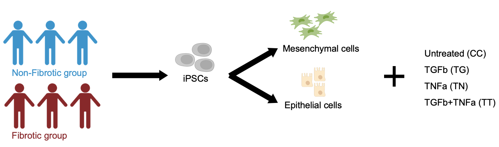

 

In this project, we collected RNA-seq data from a panel of 19 iPSC lines which comprise 10 iPSC lines derived from Crohn's disease patients who experienced fibrotic complications and 9 lines from patients with non-fibrotic complications.

These iPSCs were differentiated into gut mesenchymal and gut epithelial organoids, allowing us to study the cellular processes most relevant to CD.

Each iPSC line was differentiated into mesenchymal and epithelial organoids in two independent replicates, and each was subjected to 4 different treatments:

**Untreated, 
 
TGFb (a pro-fibrotic cytokine), 
 
TNFa (a pro-inflammatory cytokine), 
 
and the combination of TGF-b+TNF-a.**

In the end, comprising a total of 151 samples in our RNA-seq dataset.

 

## Workflow for Count Matrices

We filtered our count data to include **only protein-coding genes** with total counts surpassing 150, ensuring an average count of over 1 per sample. Next, we merged the mesenchymal and epithelial datasets to generate a unified gene list. Finally, we performed batch correction and variance stabilizing transformations on the separate mesenchymal and epithelial datasets. You can find those data in the **Counts** folder. I documented the dimensions of each matrix (genes x samples) on the right of each cell for reference.

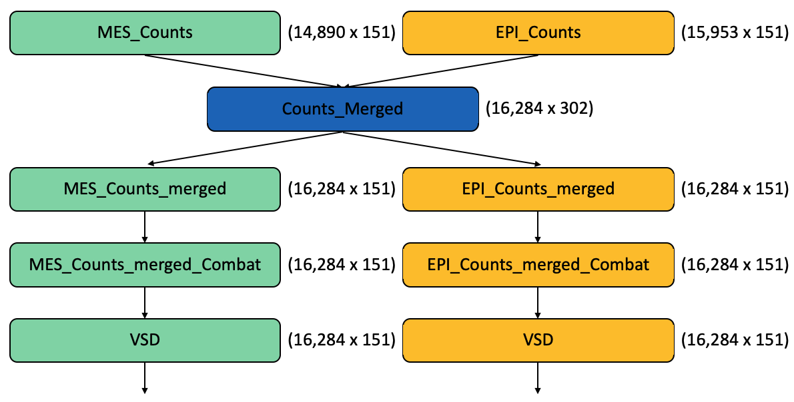

 

## PCAs

### PCA for the mesenchymal group

#### Before batch correction

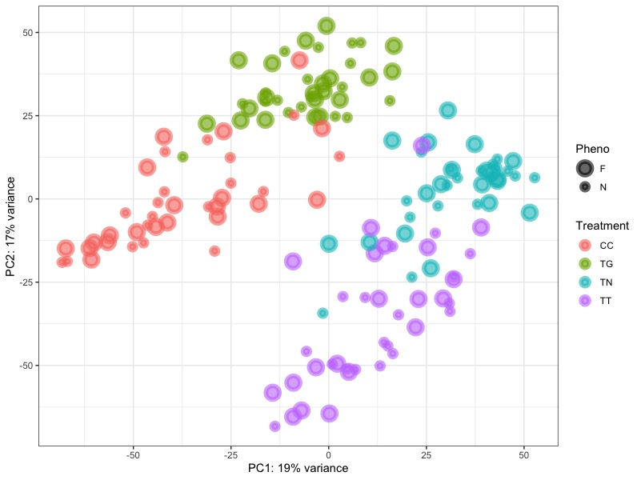
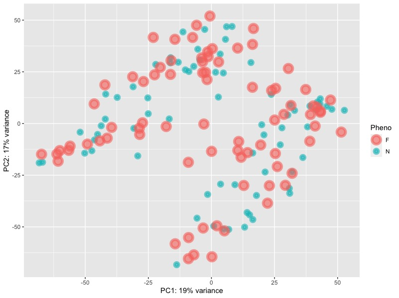

Before batch correction, we can notice that there are 4 differnt groups seperated by treatments. However, they are overlapping on each other without forming tight cluster. The variance of PC1 is 19% and the variance of PC2 is 17%. 

 

#### After batch correction

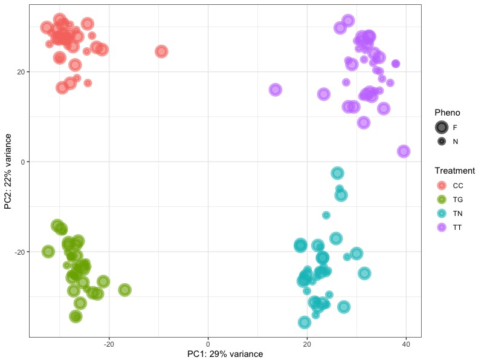
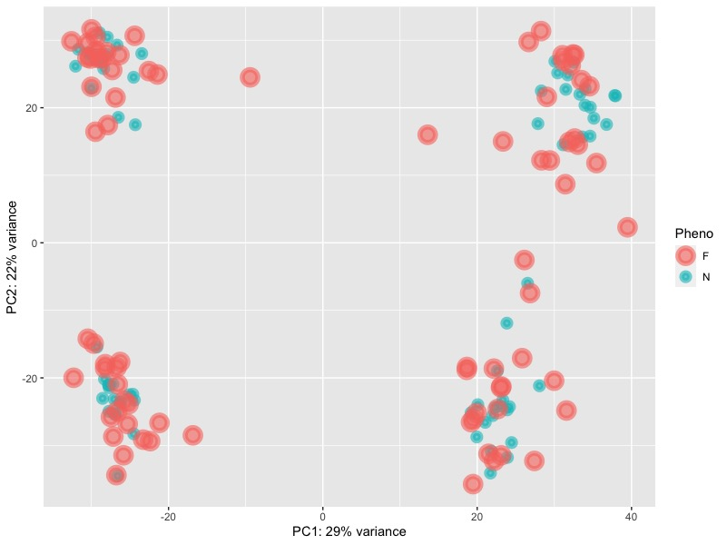

After batch correction, we can see that there are 4 clearly clustered groups located at 4 different corners. The top left corner is the control group, the bottom left corner is the TGFb group, the bottom right corner is the TNFa group, and the top right corner is the combination group. The variance of PC1 increased to 29% and the variance of PC2 increased to 22%. 

From PC1, we can seperate groups by whether they have been treated with TNFa. However, we cannot easily seperate groups by PC2. It seems that the combination group cancel out the effect of TGFb and TNFa that it localed same as the control group. Consequently, we proceeded to examine the top 3 genes identified from the loadings of PC1 and PC2 to discern any meaningful patterns.
 

#### PC1 and PC2 loadings

Top 3 genes from PC1 loadings

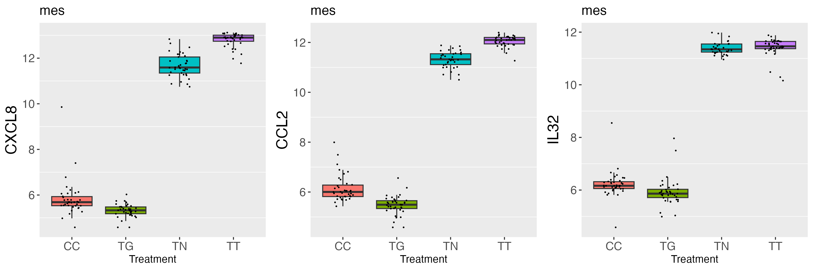

Top 3 genes from PC2 loadings

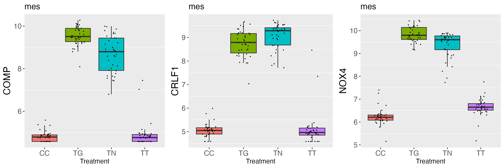

 
 

### PCA for the epithelial group

#### Before batch correction

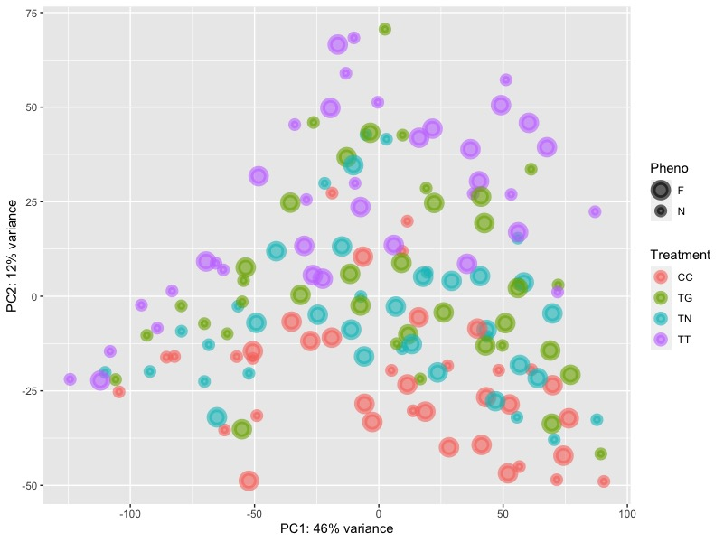
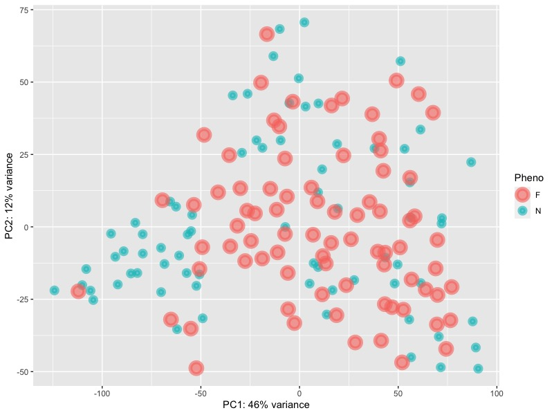

From the bottom to the top, there are 4 layers: the control group, the TNFa group, the TGFb group and the combination group. The variance of PC1 is 46% and the variance of PC2 is 12%.

 

#### After batch correction

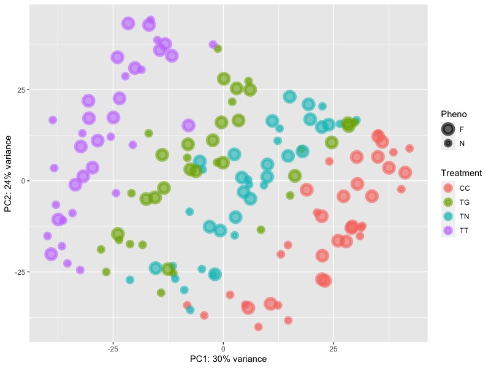
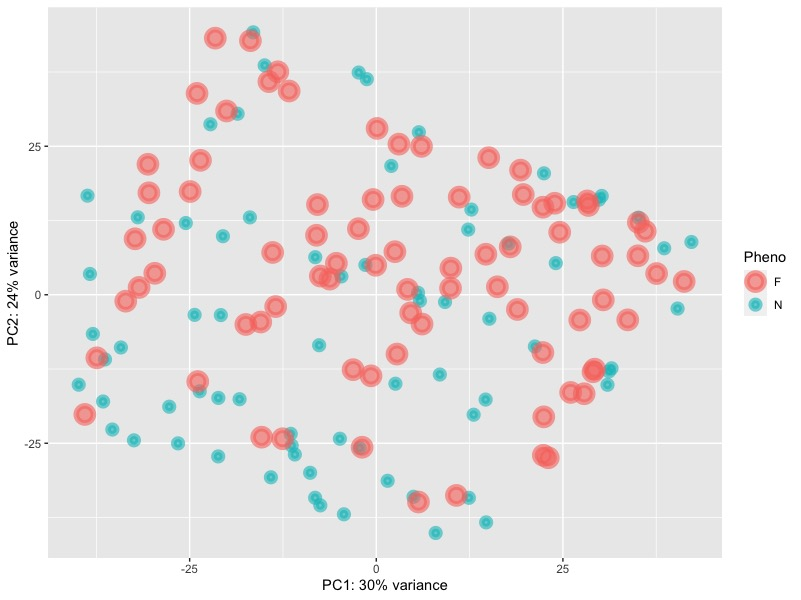

Following batch correction, there is a noticeable enhancement in the distinct separation among the four groups. While the groupings may not be as compact as those within the mesenchymal group, the improvement is substantial compared to the pre-batch correction state. Notably, the variance of PC1 accounts for 30%, and the variance of PC2 accounts for 24%.

 

