## Non-fibrotic vs. Fibrotic Patients' Gene Selection and Predictive Modeling

We've employed various machine learning techniques to enhance our feature selection process. Ultimately, we settled on employing a method known as "minimum redundancy, maximum relevance" (mRMR). This approach proved effective in comparing fibrotic versus non-fibrotic samples, both at baseline and within each treatment group.

The resulting output is a prioritized list of genes based on their relevance. One notable advantage of this method lies in its sensitivity to features (genes) that may exhibit significant bias towards, for instance, the fibrotic phenotype, even within a subset of patients.

In the subsequent phase, the selected features were utilized to construct predictive models employing machine learning techniques such as Lasso regression or mutual information approaches. The objective was to determine the minimal gene set capable of predicting the fibrotic phenotype with a specified level of accuracy. Encouragingly, the outcomes have demonstrated considerable efficacy, often requiring only a modest number of genes to achieve notable discrimination between groups.

 

## Workflow

Our workflow involves utilizing VSD values from both mesenchymal and epithelial datasets. We begin by isolating specific treatment groups, such as the control group (CC). Subsequently, we employ mRMR to identify the top 100 genes, intersecting these with the VSD matrices. Finally, we refine our gene lists using either Lasso regression or StepAIC to derive our final modules.

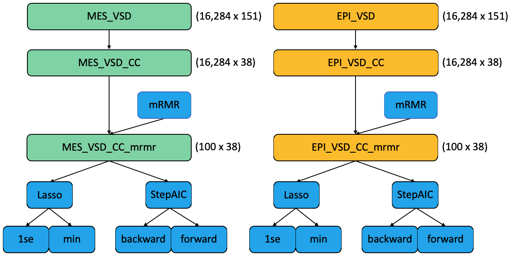

 

## Master spreadsheets

Below is a comprehensive master spreadsheet in Excel, encompassing all mRMR gene lists for mesenchymal and epithelial groups across various treatments.

[mes\_mrmr\_modules](Masters/mes_mrmr_modules.csv)

[epi\_mrmr\_modules](Masters/epi_mrmr_modules.csv)

 

## Module accuracy

### The control groups(CC) of mesenchymal and epithelial

**mes\_CC\_mrmr\_top100 : 91.7%**

**mes\_CC\_mrmr\_lasso\_1se : 92.5%**

the number of genes: 6

genes: HILPDA, DPY19L1, DNAJB6, FAM118A, NIPBL, COL16A1 

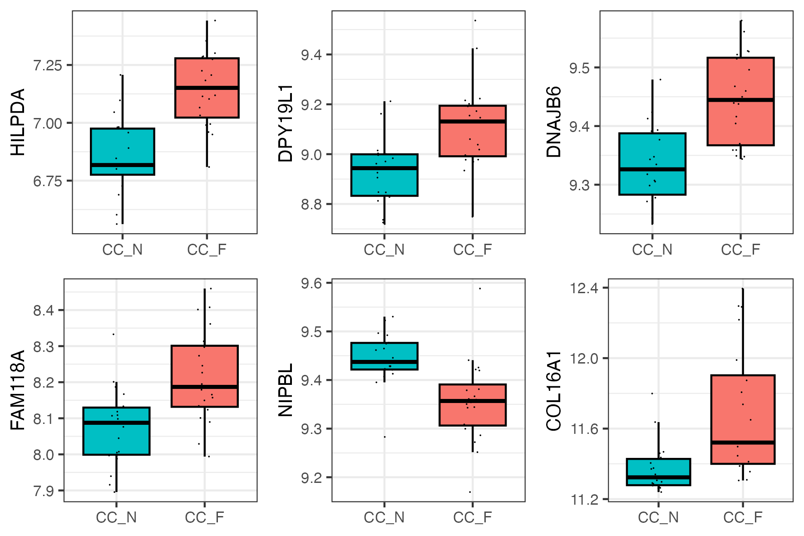

**mes\_CC\_mrmr\_lasso\_min : 97.5%**

the number of genes: 18

genes: HILPDA, DPY19L1, DNAJB6, FAM118A, LIG4, LMO4, NIPBL, ZNF160, RASAL2, ZTGHC10, POLR3A, DUS1L, CD2AP, UFM1, TRMT1L, MXI1, ITM2C, TMEM245 

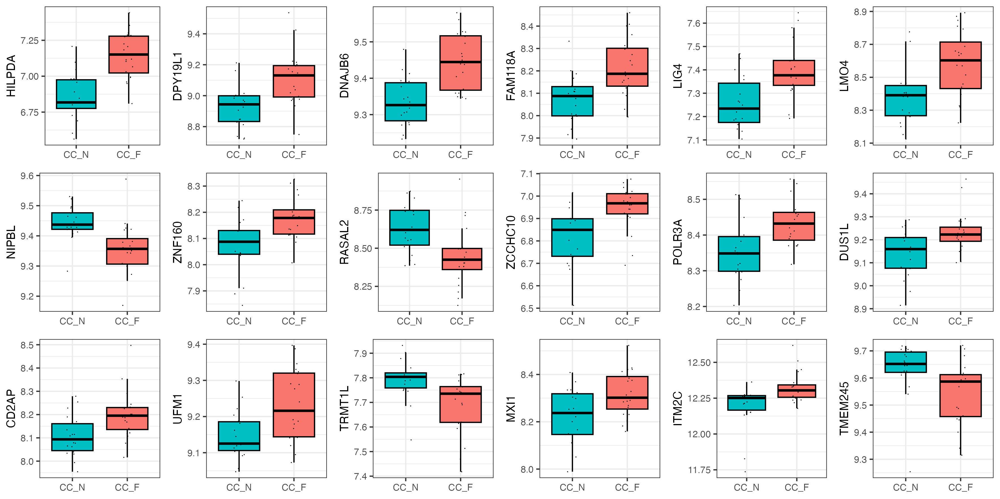

 

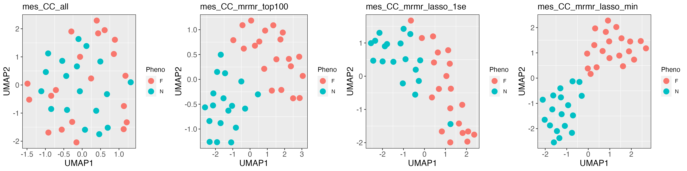

 

**epi\_CC\_mrmr\_top100 : 90.8%**

**epi\_CC\_mrmr\_lasso\_1se : 92.5%**

the number of genes: 18

genes: CDS1, ZBED6CL, SAR1A, IDH2, DPYS, FBXL17, WDR12, IFIT3, SMOC1, PIK3C2G, STEAP4, POLR2C, PRKCH, GABRB3, SLC25A11, GKN1, LCAT, LGALS9

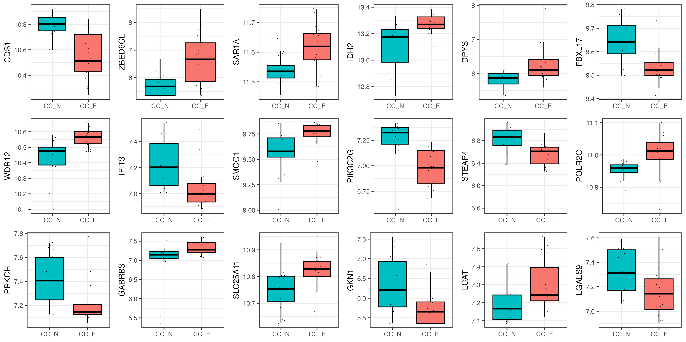

**epi\_CC\_mrmr\_lasso\_min : 93.3%**

the number of genes: 18

genes: CDS1, ZBED6CL, IDH2, FBXL17, WDR12, ANKRD36, SMOC1, PIK3C2G, STEAP4, MOB3B, HDGF, POLR2C, PRKCH, GABRB3, GKN1, SFMBT1, LCAT, LGALS9

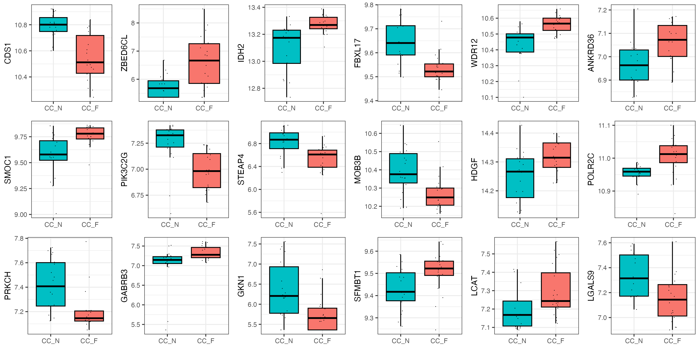

 

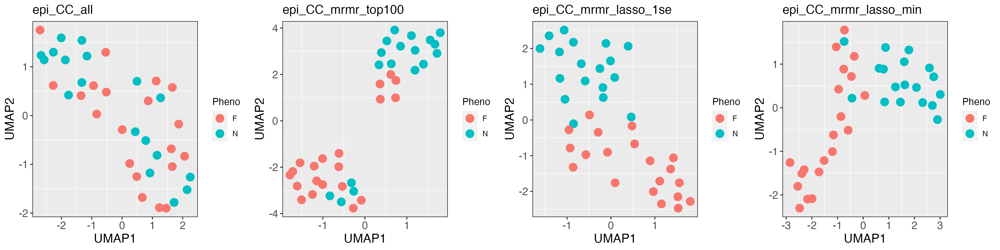

 

### The TGFb groups(TG) of mesenchymal and epithelial

**mes\_TG\_mrmr\_top100 : 95%**

**mes\_TG\_mrmr\_backward : 85.3%**

the number of genes: 5

genes: LIMK2, CASP7, HILPDA, PPP6R3, DIS3L2

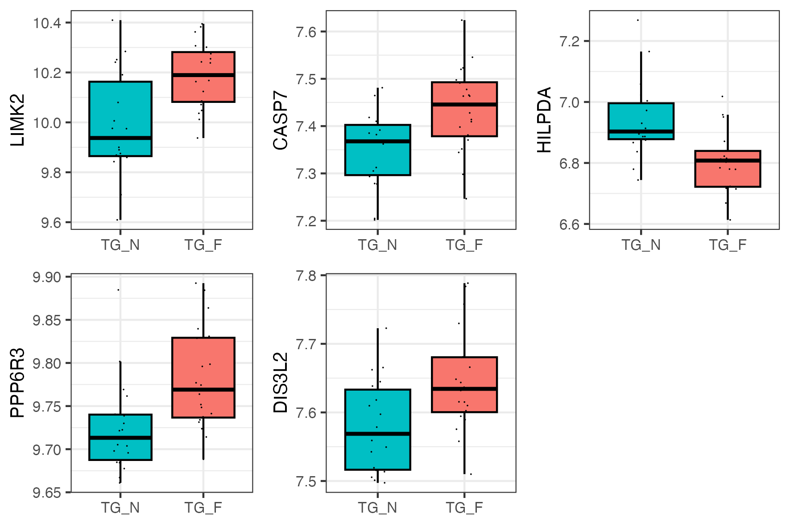

**mes\_TG\_mrmr\_forward : 82.5%**

the number of genes: 3

genes: GSTT2B, TXLNA, HILPDA

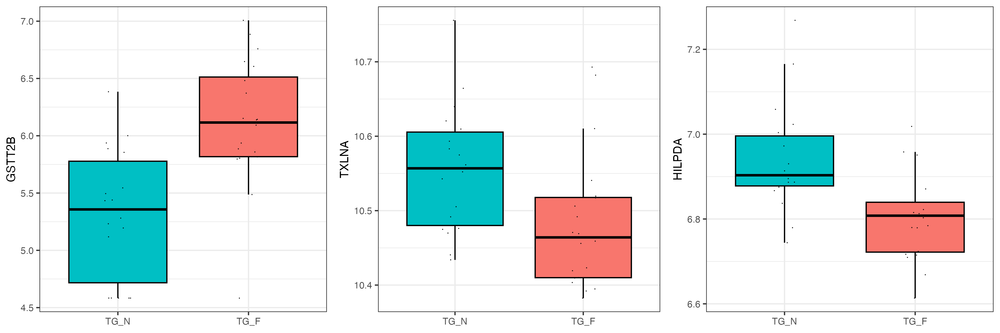

 

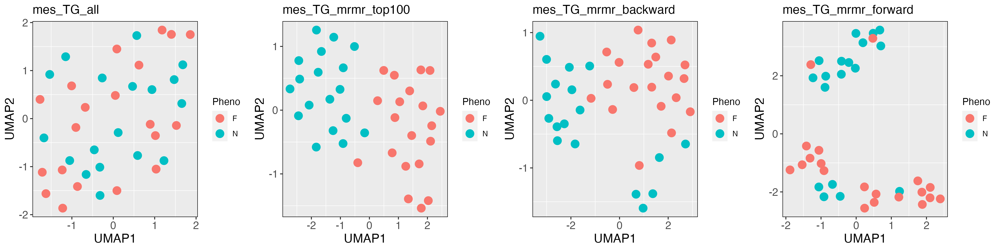

 

**epi\_TG\_mrmr\_top100 : 90%**

**epi\_TG\_mrmr\_lasso\_1se : 94.2%**

the number of genes: 24

genes: CHST7, ZBED6CL, ZNF846, TTC26, EIF3J, SLC52A3, HDAC8, TAB1, SLC35E3, SPTAN1, STYK1, DNAJC14, VSIR, ITPRID2, CYP4X1, EEF1AKMT1, CTSA, ABTB1, HPGD, QSOX2, NBPF14, KIF13B, CSTF2, SLC2A2

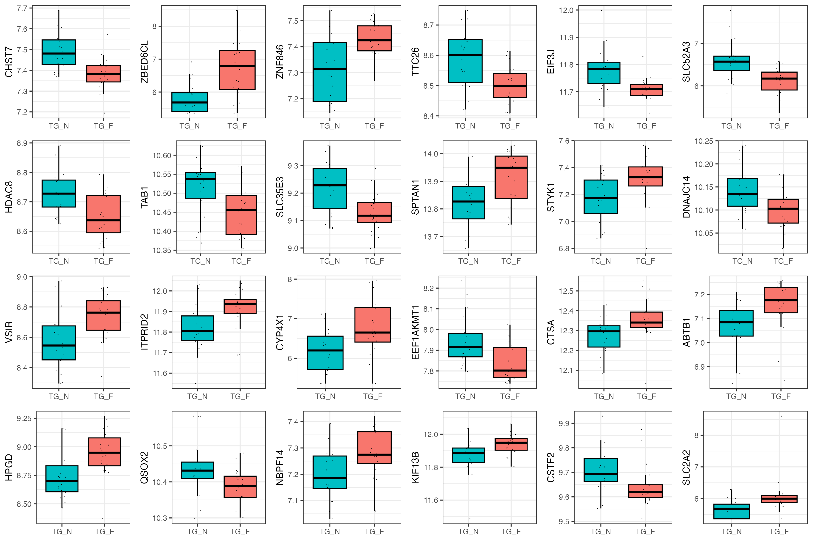

**epi\_TG\_mrmr\_lasso\_min : 92.5%**

the number of genes: 25

genes: CHST7, ZBED6CL, ZNF846, TTC26, EIF3J, SLC52A3, HDAC8, TAB1, SLC35E3, SPTAN1, STYK1, DNAJC14, EMX2, VSIR, ITPRID2, CYP4X1, EEF1AKMT1, CTSA, ABTB1, HPGD, QSOX2, NBPF14, KIF13B, CSTF2, SLC2A2 

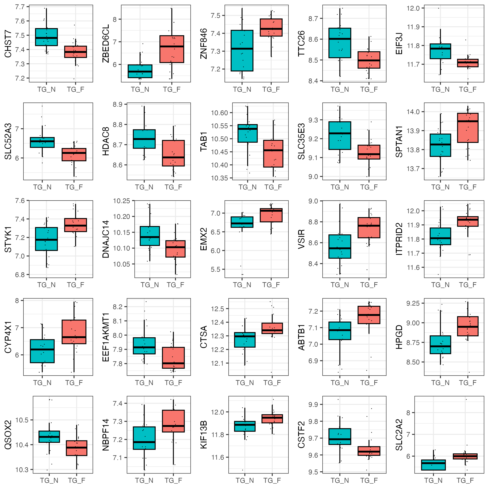

 

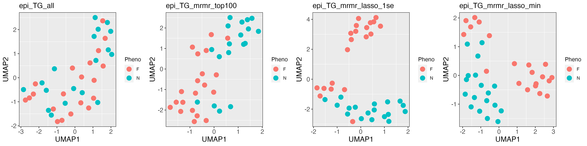

 

### The TNFa groups(TN) of mesenchymal and epithelial

**mes\_TN\_mrmr\_top100 : 92.5%**

**mes\_TN\_mrmr\_Lasso\_lse : 97.5%**

the number of genes: 24

genes: PER2, LGMN, IMPACT, DIP2C, RAB21, ITM2C, CLDN1, PJA1, UBE2J2, GPATCH3, HDDC2, COL16A1, DIS3L2, TFDP1, GRAMD4, EWSR1, ZMPSTE24, PCBP3, EFTUD2, GLUD1, IPP, TENT4B, AC093012.1, LMBR1

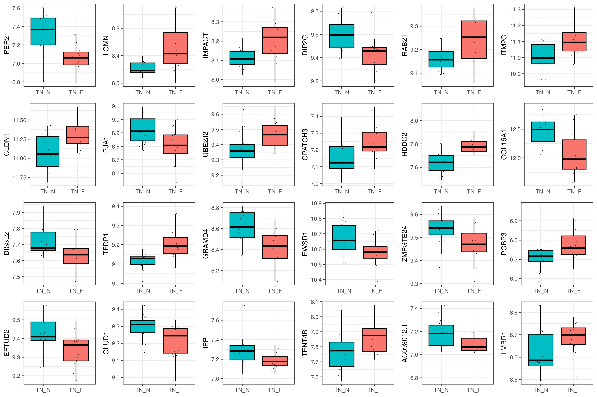

**mes\_TN\_mrmr\_Lasso\_min : 95.8%**

the number of genes: 26

genes: LGMN, IMPACT, SLC66A1, DIP2C, RAB21, ITM2C, CLDN1, DDI2, PJA1, UBE2J2, GPATCH3, HDDC2, COL16A1, DIS3L2, TFDP1, ZMPSTE24, EME2, PCBP3, FBXL17, ATP10D, EFTUD2, DPYSL4, IPP, TENT4B, AC093012.1, LMBR1

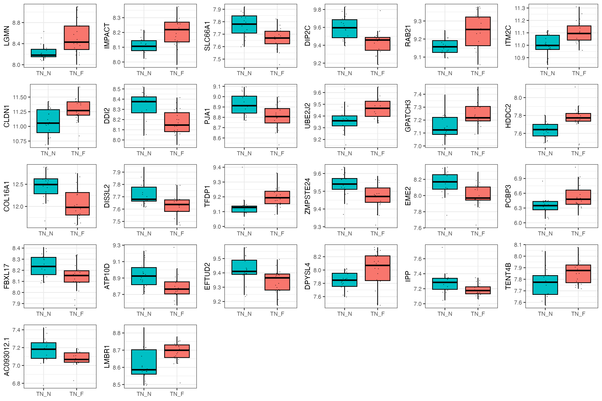

 

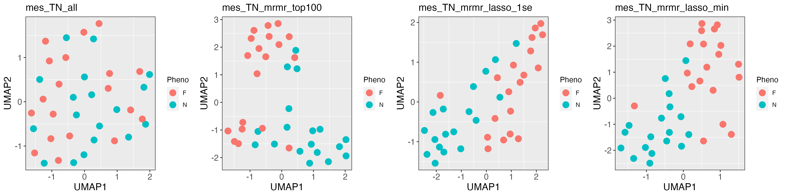

 

**epi\_TN\_mrmr\_top100 : 90.8%**

**epi\_TN\_mrmr\_lasso\_min : 92.5%**

the number of genes: 23

genes: PLB1, SLC52A3, CNTLN, EFCAB7, DUSP14, BCDIN3D, TMEM176B, ARMC2, PLBD1, APOBEC3B, CLDN18, CYP4X1, ZBED6CL, IL15RA, ANKRD46, SHISA2, GCOM1, DDX60L, OTX2, CRADD, KANK4, PIK3C2G, C16orf70

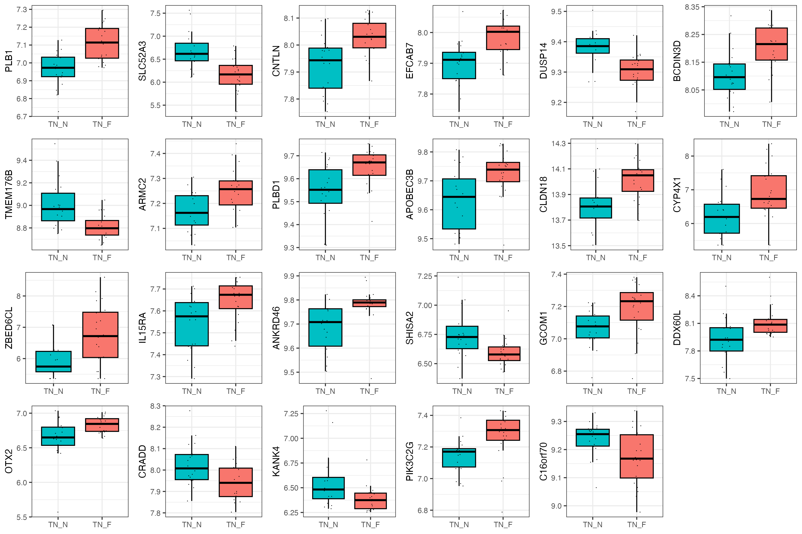

**epi\_TN\_mrmr\_backward : 88.3%**

the number of genes: 4

genes: PLB1, CNTLN, GSTT2B, APOBEC3B

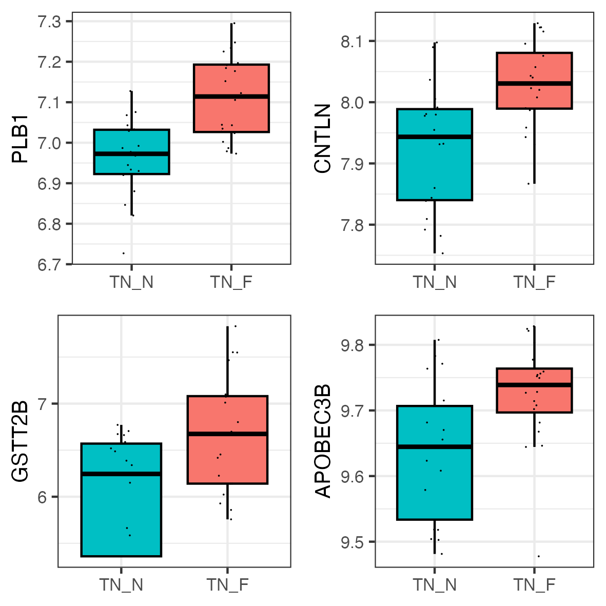

**epi\_TN\_mrmr\_forward : 81.6%**

the number of genes: 4

genes: PLB1, ACSL1, ZNF525, SHISA2

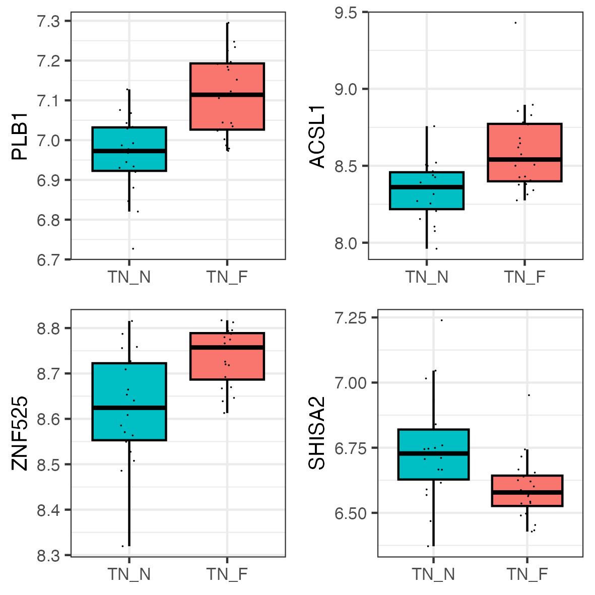

 

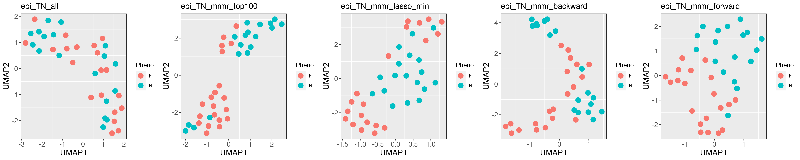

 

### The TGFb + TNFa groups(TT) of mesenchymal and epithelial

**mes\_TT\_mrmr\_top100 : 91.67%**

**mes\_TT\_mrmr\_Lasso\_lse : 88.33%**

the number of genes: 6

genes: HILPDA, NIPBL, KIAA2013, INVS, NFYA, ADAM9

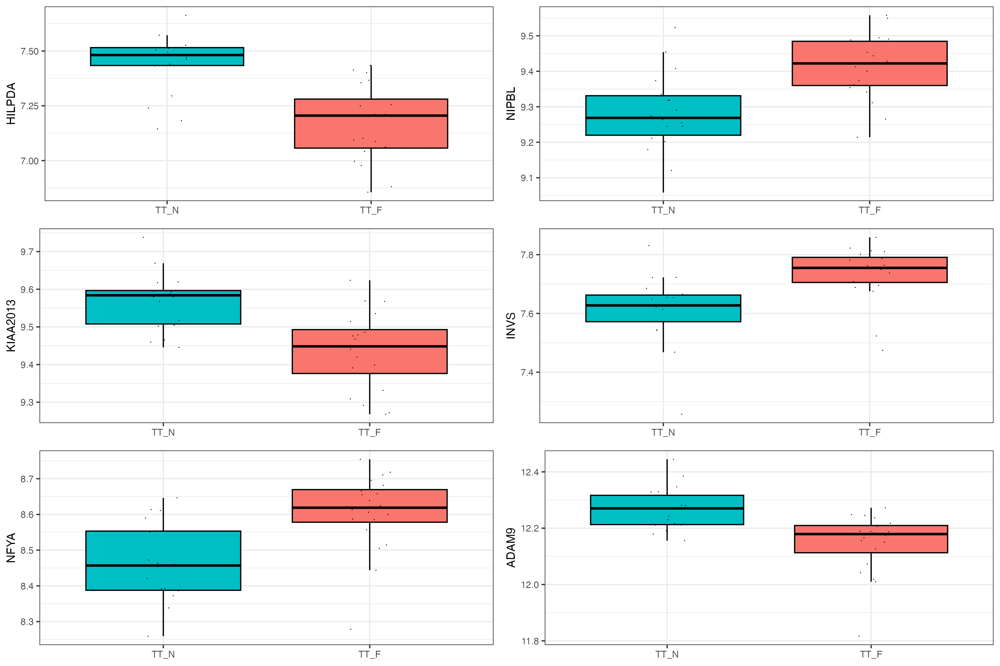

**mes\_TT\_mrmr\_Lasso\_min : 95%**

the number of genes: 30

genes: SLC38A2, NIPBL, KIAA2013, INVS, TRNT1, DIP2C, NFYA, FBXL17, ADAM9, CTCF, CRELD1, PES1, INTS8, ZCCHC14, ITPKC, CCNG2, CAPZA1, SEMA4B, MB21D2, LIME1, SRC, DPYSL4, SDHB, ZSCAN32, PCDHGA7, SAC3D1, KNOP1, POLM, FUT8, VAMP3

 

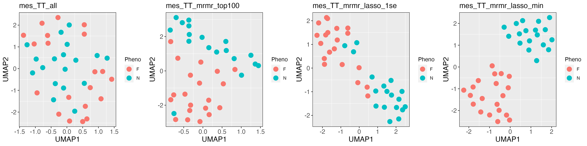

 

**epi\_TT\_mrmr\_top100 : 86.67%**

**epi\_TT\_mrmr\_lasso\_min : 95%**

the number of genes: 24

genes: SLC52A1, ZBED6CL, HEY1, SLC22A8, FERMT3, NCF1, LDHC, PCDHA3, TPR, NXT2, SRY, TAF1, C12orf4, MTMR12, NOTCH4, TMEM14C, MED27, TEX14, FRMPD4, PRM1, RAB40C, SCARF2, GLIPR1L2

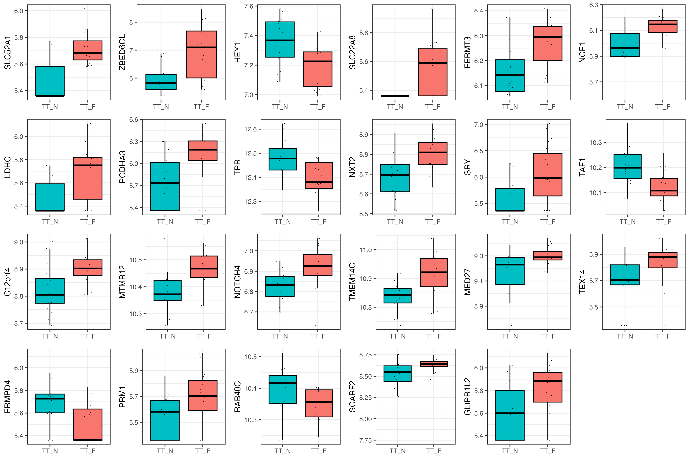

**epi\_TT\_mrmr\_backward : 74.17%**

the number of genes: 4  

genes: HEY1, TPR, ACOT12, AP4S1

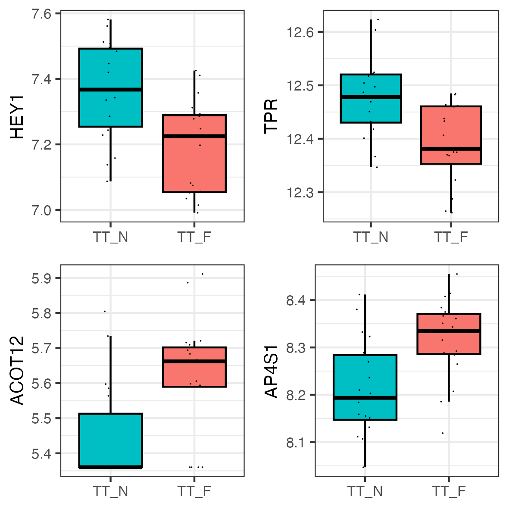

**epi\_TT\_mrmr\_forward : 80%**

the number of genes: 3

genes: SLC52A1, POLR3E, SAMD9L

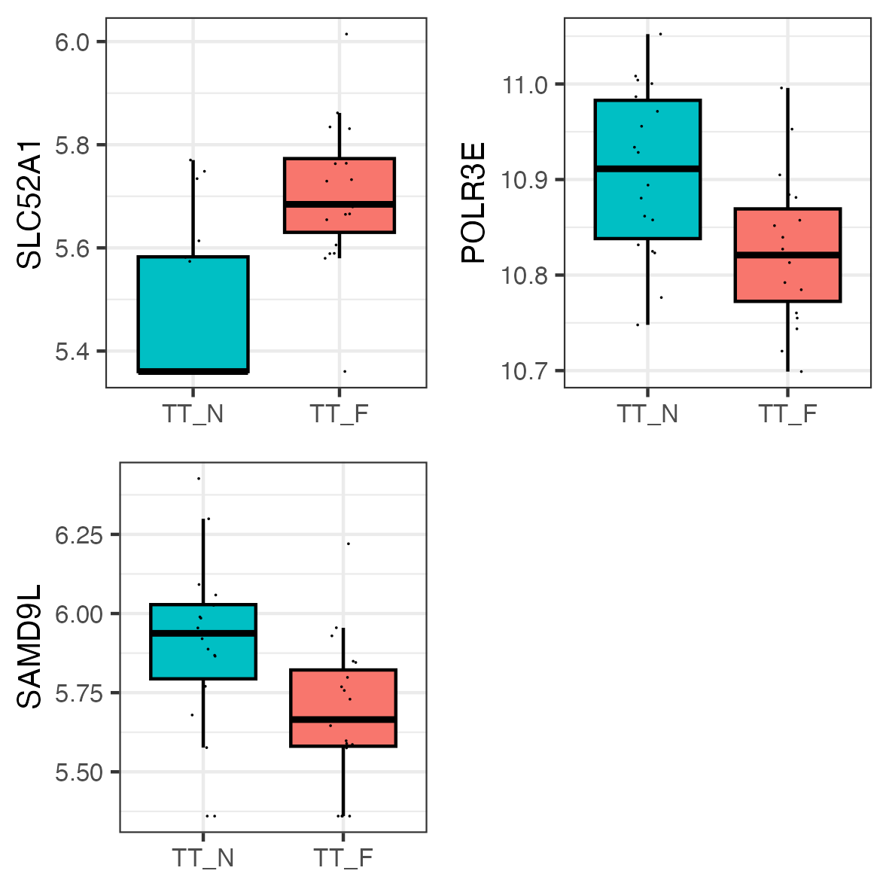

 

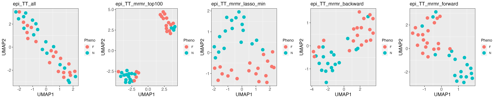

 

## Conclusion

In summary, both Lasso regression and stepAIC demonstrate surprisingly high accuracy in our analyses. In my view, Lasso regression tends to yield higher accuracy compared to stepAIC. However, it's worth noting that Lasso regression typically involves the inclusion of more genes compared to stepAIC.

 

